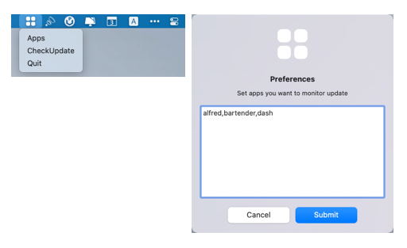

# Apps Update Reminder

Automatically check whether the apps has new updates and send notification reminders.

## Install

``` shell
# install rumps
pip uninstall rumps
git clone git@github.com:jaredks/rumps.git
cd rumps
python setup.py install

# install other requirements
pip install -r requirements.txt

# generate app
python setup.py py2app

# move the app to the applications
mv dist/Apps\ Update\ Reminder.app /Applications
```

## Sample



## Solutions to errors

**libpython.dylib not found error**

```
ErrorMessage:
ValueError: '/Users/username/.pyenv/versions/3.8.0/lib/libpython3.8.dylib' does not exist

Solution:
env PYTHON_CONFIGURE_OPTS="--enable-framework" pyenv install -v 3.8.0

Reference:
https://github.com/visini/pomodoro/issues/1
```

**rumps notification data passing exception**

```
ErrorMessage:
2019-11-29 18:03:11.936 Python[74881:1454881] -[OC_BuiltinPythonData fastestEncoding]: unrecognized selector sent to instance 0x7fa05ed3e910

Solution:
pip uninstall rumps
git clone git@github.com:jaredks/rumps.git
cd rumps
python setup.py install

Reference:
https://github.com/jaredks/rumps/issues/126
https://github.com/jaredks/rumps/pull/131
```

